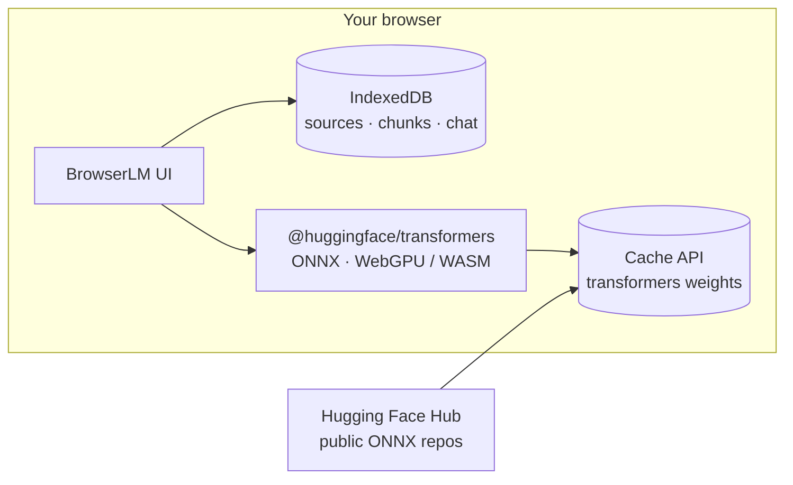

<div align="center">

# BrowserLM

**Private, in-browser AI chat and RAG — no server, no upload.**

[](LICENSE)
[](https://github.com/huggingface/transformers.js)
[](https://developer.mozilla.org/en-US/docs/Web/API/WebGPU_API)

*Ask questions about your PDFs and text files. Everything runs locally in Chromium-class browsers.*

[Why BrowserLM?](#why-browserlm) · [Features](#features) · [Quick start](#quick-start) · [Demo](https://browserlm.ree.kz/) · [How it works](#how-it-works) · [Models](#models) · [Privacy](#privacy) · [FAQ](#faq) · [Contributing](#contributing) · [License](#license)

</div>

---

## Why BrowserLM?

| | |
| --- | --- |
| **Zero backend** | Open `index.html` through a static server — models load into the [Cache API](https://developer.mozilla.org/en-US/docs/Web/API/Cache) and run with ONNX in the tab. |
| **Your data stays yours** | Documents are chunked and embedded in **IndexedDB** on your machine. Nothing is sent to a custom API. |
| **WebGPU when available** | Faster generation on supported GPUs; falls back to **WASM** so the app still runs without WebGPU. |
| **Single-page core + PWA shell** | Markup, styles, and the main ES module (Transformers, RAG, chat) live in **`index.html`**. **`manifest.webmanifest`**, **`sw.js`** (registered as `./sw.js`), and **`favicon.svg`** provide installability and shell caching after the first load. |

---

## Features

- **Chat** — general instruction following with streaming-style token updates.
- **RAG** — upload **TXT, Markdown, CSV, JSON, PDF**; semantic search over chunks; answers grounded in retrieved context.
- **Vision-language (VL) LLMs** — optional models combine **text + images** in the chat pipeline; they require **WebGPU** (text-only models still run on WASM without WebGPU).
- **Progress UX** — download progress, ETA hints, cancelable model loads (fetch patched with `AbortSignal`).
- **Welcome setup** — estimated download size, optional **hardware acceleration / WebGPU** status before loading weights.
- **Persistence** — chat history and document index stored in IndexedDB (`LocalRAGChatDB`, schema version **2**); model choice in `localStorage` (with legacy keys migrated from older builds).
- **PWA** — installable via **Web App Manifest**; **service worker** (`sw.js`) precaches `index.html`, manifest, and icon for faster revisits and limited offline shell behavior when assets are already cached.
- **Responsive UI** — dark theme, sidebar, drag-and-drop, Markdown rendering (sanitized), mobile-friendly layout (`100dvh`, safe-area-friendly meta tags).
- **Model cache panel** — inspect and remove cached ONNX weights per model from the sidebar.

---

## Quick start

**Live demo:** [https://browserlm.ree.kz/](https://browserlm.ree.kz/) — open in the browser without a local server.

> **Important:** do **not** open `index.html` as `file://`. ES modules and the Transformers cache need a **local HTTP origin**.

### Option A — Python

From the repository root (the folder that contains `index.html`):

```bash
python -m http.server 8080
```

Then open [http://localhost:8080](http://localhost:8080).

### Option B — Node (npx)

From the same folder:

```bash
npx --yes serve -l 8080
```

### Option C — VS Code

Use the **Live Server** extension and open the project folder.

### First launch

1. Pick an **LLM** and an **embedding** model in the welcome dialog (sizes are shown; smaller models download faster).
2. Wait for weights to download (cached for next visits).
3. Add files from the sidebar or drag them onto the page — then ask questions in the chat.

---

## How it works



1. **Embeddings** — `feature-extraction` pipeline builds vectors for each text chunk.
2. **Retrieval** — cosine similarity between the query embedding and stored chunk vectors.
3. **Generation (text LLMs)** — `text-generation` pipeline with optional chat template; context injected for RAG turns.
4. **Generation (VL models)** — vision+text checkpoints use a dedicated processor and **WebGPU**-only session; document RAG still relies on the text embedding model for chunk vectors.

PDF text is extracted in-browser with **pdf.js** (loaded from CDN when you import a PDF).

---

## Models

Defaults favor **small downloads first** in the UI (default text LLM key **`lfm2_350m`**); embedding default leans **multilingual MiniLM** for broader language coverage in RAG.

| Kind | Examples (from UI) |
| --- | --- |
| **LLM (text)** | LFM2 350M/700M, Granite 4.0 350M, Llama 3.2 1B, Gemma 3 1B, Phi-3.5 Mini — ONNX builds from the Hugging Face ecosystem (WebGPU + WASM dtypes where configured). |
| **LLM (vision + text)** | LFM2.5-VL 450M, Qwen3.5 0.8B / 2B OPT, Gemma 4 Instruct E2B / E4B — **VL-only path**, larger downloads, **WebGPU required** (see in-app message if GPU acceleration is off). |
| **Embeddings** | MiniLM L6, GTE Small, Multilingual MiniLM — public ONNX / Xenova-compatible checkpoints. |

Exact IDs, labels, and approximate sizes are defined in `index.html` (`GEN_MODELS`, `EMB_MODELS`). If a model returns **401/404**, it may be gated or lack public ONNX weights — pick another pair in the sidebar.

---

## Privacy

- No account, no telemetry endpoint in this template.
- Files and embeddings never leave your browser by design.
- Third-party CDNs are used for **libraries** (Tailwind, Lucide, Marked, DOMPurify, Slim Select, pdf.js, `esm.sh` for Transformers). Audit those URLs if you need an air‑gapped build (self-host assets and swap the module URL).
- The service worker only caches **same-origin** shell files (`index.html`, manifest, favicon) — it does not proxy your documents or model blobs to a remote server.

---

## Requirements

- **Browser:** recent **Chrome**, **Edge**, **Brave**, or another Chromium build with modern JS and (optionally) WebGPU for faster **text** models.
- **Vision-language models** require **WebGPU**; plain text LLMs still run with **WASM** when WebGPU is unavailable.
- **Disk & RAM:** depends on models — small pairs are hundreds of MB; larger LLMs need several GB free and enough RAM for comfortable use.
- **Network:** first-time model download; afterwards mostly cache hits.

---

## Project layout

The repo is **flat** at the root: there is no `src/`, `public/`, or `assets/` tree — everything ships as a few static files.

| File | Role |
| --- | --- |
| **`index.html`** | Single entry point: UI markup, inline `<style>`, and a `<script type="module">` block with all app logic (model lists, IndexedDB, RAG, chat, service worker registration). |
| **`sw.js`** | Service worker: precaches the shell (`index.html`, manifest, icon) and same-origin document/manifest/SVG fetches. |
| **`manifest.webmanifest`** | PWA manifest (`start_url`, `scope`, theme, icons pointing at `favicon.svg`). |
| **`favicon.svg`** | Tab and install icon (also referenced from the HTML head and manifest). |
| **`LICENSE`** | MIT license text. |
| **`README.md`** | This file. |

```text
.
├── index.html
├── sw.js
├── manifest.webmanifest
├── favicon.svg
├── LICENSE
└── README.md
```

---

## FAQ

**Why do I see a banner about `file://`?**  
Browsers block ES module imports and cache behavior from `file://` origins. Use any static HTTP server on `localhost`.

**Can I use it offline?**  
After models and scripts are cached by the browser, many flows work offline; cold starts still expect cached assets.

**Where is chat stored?**  
IndexedDB database **`LocalRAGChatDB`**, version **2** (object stores include chat history and RAG index data).

**Can I install BrowserLM like an app?**  
Yes: serve over HTTP(S), open in Chromium, and use **Install** / **Add to Home Screen** — `manifest.webmanifest` defines standalone display and theme colors (`#09090b`).

**How do I reset everything?**  
Use **Clear memory** (documents) and the eraser control for chat history; use the cache panel to remove downloaded weights.

---

## Contributing

Issues and PRs are welcome: performance on low-end devices, i18n, self-hosted bundle mode, and accessibility are especially valuable.

1. Fork the repository  
2. Create a branch for your change  
3. Test with a local server (see [Quick start](#quick-start))  
4. Open a pull request with a short description of behavior and risk

---

## License

This project is released under the [MIT License](LICENSE). See [`LICENSE`](LICENSE) for the full text.

---

<div align="center">

**If BrowserLM saved you a round-trip to the cloud, consider starring the repo — it helps others discover it.**

Made with care for local-first AI.

</div>
